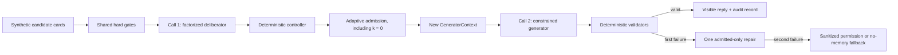

# Architecture

## Trust boundaries

`apply_hard_gates` receives canonical Pydantic cards. Hard-rejected card content never reaches a provider call. The full method’s deliberator sees only eligible cards; permission-only cards can be assessed but never directly used.

`build_generator_context` allocates a fresh object made of `AdmittedMemoryView` values. It excludes original cards, ignored text, gate traces, rankings, and rationales. An ask-first view has no `allowed_content`. The no-separation ablation deliberately serializes every direct-eligible full card plus action decisions, and P0 tests assert this request differs from the full method.

The API stores normalized run records in local SQLite. Browser code receives run data, never provider credentials. Raw provider payload logging is off by default.

